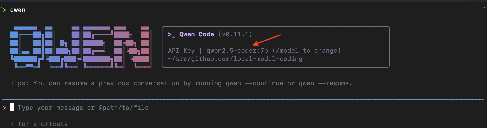

# local-model-coding

A guide to setup local coding AI model(s) without any subscriptions. 100% free!

# What do you need?

- VS Code
- Ollama
- Continue VS Code extension 
- _and_ some models

# Setup Instructions

1) **Install Ollama**

Install it either via the terminal or download the executable [from here](https://ollama.com/download).

```sh
curl -fsSL https://ollama.com/install.sh | sh
```

2) **Update your shell variables**

Put the following lines in your `.zshrc` or `.bashrc` file on a Mac. 

```sh
export PATH="/Users/{your_user}/.local/bin:$PATH" # MacOS

# For Ollama (no auth required)
export OLLAMA_API_KEY="ollama"
export OPENAI_BASE_URL=http://localhost:11434/v1
export OPENAI_MODEL=qwen2.5-coder:7b
export OPENAI_API_KEY=ollama
export OLLAMA_FLASH_ATTENTION=1
export OLLAMA_CONTEXT_LENGTH=8192
```

`Set` the values in your shell on Windows -- read how to do so [here](https://stackoverflow.com/questions/18701783/windows-equivalent-of-export).


2) **Download local models**

Qwen Coder 7b model:

```sh
ollama pull qwen2.5-coder:7b
```

Embedding model:

```sh
ollama pull nomic-embed-text:latest
```

Deepseek Coder 6.7b model (download this in case you don't get satisfactory results from Qwen):

```sh
ollama pull deepseek-coder:6.7b
```

3) **Install the `Continue` Extension**

Search for the "Continue" extension in VS Code and install it. Read more about Continue [here](https://docs.continue.dev/ide-extensions/install).

4) **Edit `Continue` configuration**

```yaml
name: Local Config
version: 1.0.0
schema: v1
models:
  - name: Qwen2.5-Coder 7B
    provider: ollama
    model: qwen2.5-coder:7b
    roles:
      - autocomplete
      - chat
      - edit
      - apply
    contextLength: 8192
  - name: Nomic Embed
    provider: ollama
    model: nomic-embed-text:latest
    roles:
      - embed
```

5) **Add a `.continueignore` file**

If you don't want **Continue** to index everything, add the `.continueignore` file.

```bash
node_modules
dist
build
coverage
.git
```

6) **Start Ollama**

```sh
ollama serve
```

7) **Verify local models**

```sh
ollama list
```

You should see a list similar to this:
```sh
NAME                       ID              SIZE      MODIFIED
deepseek-coder:6.7b        ce298d984115    3.8 GB    4 minutes ago
nomic-embed-text:latest    0a109f422b47    274 MB    17 minutes ago
qwen2.5-coder:7b           dae161e27b0e    4.7 GB    4 hours ago
```

8) **Launch VS Code**

Lauch VS Code in your project repo and start vibe coding for free 🚀

9) **Bonus: CLI based coding**

Note: IME this doesn't work as well as the tab auto-complete, but if you want to give it a try, follow the steps below:

A) **Download `qwen-code`**

```sh
brew install qwen-code
```

Check that the model selected is your local model like in the image below:



B) **Launch Qwen Code**

Launch Qwen using the following command in your project directory:

```sh
> cd my-project
> qwen
```
